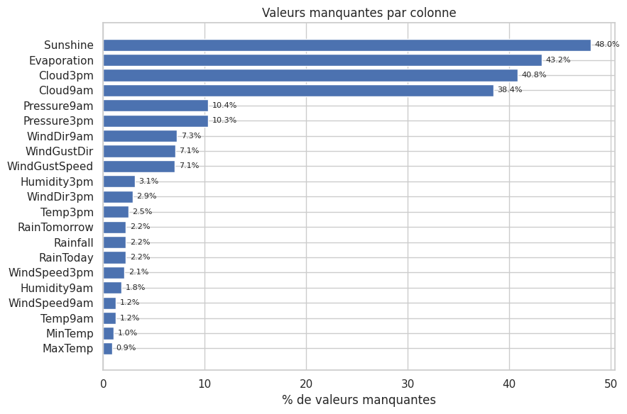
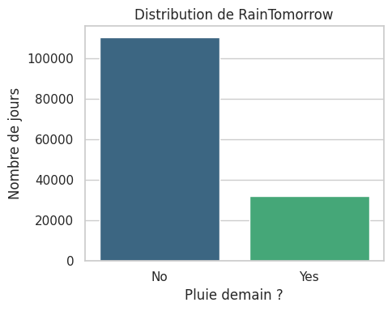
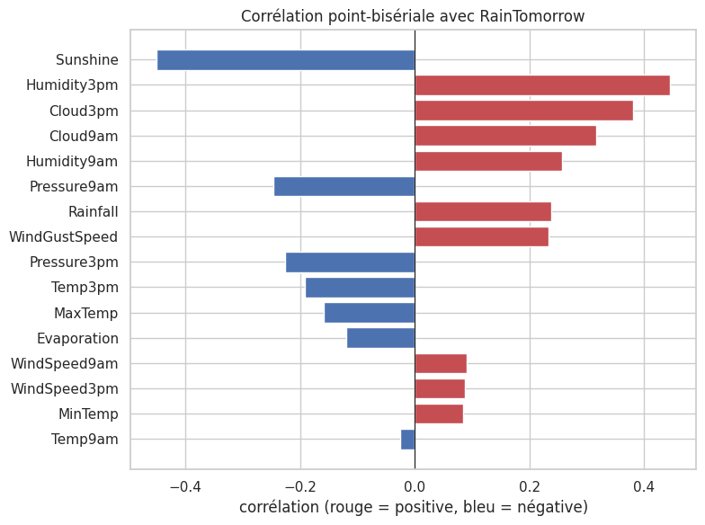
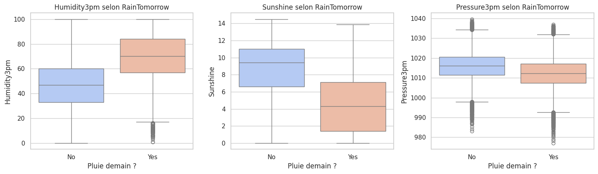
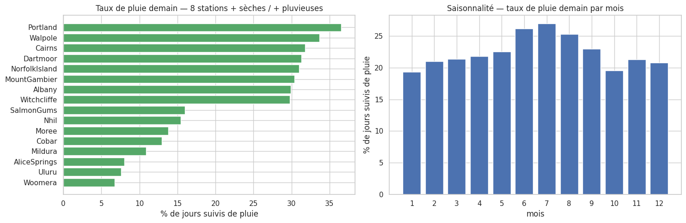

# Prévision de pluie en Australie — 1/3 · Exploration (EDA)

Dataset Kaggle *Rain in Australia*. Cible : `RainTomorrow` (pluie demain).

**Cette partie** : chargement, qualité des données, variable cible & déséquilibre, baselines, corrélations, dimensions géographique & saisonnière.

Suite : `02_preprocessing.ipynb` (préparation) puis `03_modelisation.ipynb` (modèles).

## 0. Setup & chargement des données


```python
import warnings
from pathlib import Path

import numpy as np
import pandas as pd
import matplotlib.pyplot as plt
import seaborn as sns

warnings.filterwarnings("ignore", category=FutureWarning)
sns.set_theme(style="whitegrid")
pd.set_option("display.max_columns", 30)
RANDOM_STATE = 42
```

    /home/tinkerbell/.local/lib/python3.12/site-packages/matplotlib/projections/__init__.py:63: UserWarning: Unable to import Axes3D. This may be due to multiple versions of Matplotlib being installed (e.g. as a system package and as a pip package). As a result, the 3D projection is not available.
      warnings.warn("Unable to import Axes3D. This may be due to multiple versions of "


```python
# Résolution robuste du chemin des données : fonctionne que le notebook soit
# lancé depuis la racine du projet ou depuis le dossier notebooks/.
CANDIDATES = [
    Path("Data/weatherAUS.csv"),
    Path("../Data/weatherAUS.csv"),
    Path.home() / "Desktop/MlOps_Meteo-Liora/Data/weatherAUS.csv",
]
DATA_PATH = next((p for p in CANDIDATES if p.exists()), None)
assert DATA_PATH is not None, "weatherAUS.csv introuvable (vérifier le dossier Data/)"

df = pd.read_csv(DATA_PATH, na_values=["NA"])
print(f"Chargé depuis : {DATA_PATH}")
print(f"Dimensions    : {df.shape[0]:,} lignes × {df.shape[1]} colonnes")
df.head()
```

    Chargé depuis : ../Data/weatherAUS.csv
    Dimensions    : 145,460 lignes × 23 colonnes


<div>
<style scoped>
    .dataframe tbody tr th:only-of-type {
        vertical-align: middle;
    }

    .dataframe tbody tr th {
        vertical-align: top;
    }

    .dataframe thead th {
        text-align: right;
    }
</style>
<table border="1" class="dataframe">
  <thead>
    <tr style="text-align: right;">
      <th></th>
      <th>Date</th>
      <th>Location</th>
      <th>MinTemp</th>
      <th>MaxTemp</th>
      <th>Rainfall</th>
      <th>Evaporation</th>
      <th>Sunshine</th>
      <th>WindGustDir</th>
      <th>WindGustSpeed</th>
      <th>WindDir9am</th>
      <th>WindDir3pm</th>
      <th>WindSpeed9am</th>
      <th>WindSpeed3pm</th>
      <th>Humidity9am</th>
      <th>Humidity3pm</th>
      <th>Pressure9am</th>
      <th>Pressure3pm</th>
      <th>Cloud9am</th>
      <th>Cloud3pm</th>
      <th>Temp9am</th>
      <th>Temp3pm</th>
      <th>RainToday</th>
      <th>RainTomorrow</th>
    </tr>
  </thead>
  <tbody>
    <tr>
      <th>0</th>
      <td>2008-12-01</td>
      <td>Albury</td>
      <td>13.4</td>
      <td>22.9</td>
      <td>0.6</td>
      <td>NaN</td>
      <td>NaN</td>
      <td>W</td>
      <td>44.0</td>
      <td>W</td>
      <td>WNW</td>
      <td>20.0</td>
      <td>24.0</td>
      <td>71.0</td>
      <td>22.0</td>
      <td>1007.7</td>
      <td>1007.1</td>
      <td>8.0</td>
      <td>NaN</td>
      <td>16.9</td>
      <td>21.8</td>
      <td>No</td>
      <td>No</td>
    </tr>
    <tr>
      <th>1</th>
      <td>2008-12-02</td>
      <td>Albury</td>
      <td>7.4</td>
      <td>25.1</td>
      <td>0.0</td>
      <td>NaN</td>
      <td>NaN</td>
      <td>WNW</td>
      <td>44.0</td>
      <td>NNW</td>
      <td>WSW</td>
      <td>4.0</td>
      <td>22.0</td>
      <td>44.0</td>
      <td>25.0</td>
      <td>1010.6</td>
      <td>1007.8</td>
      <td>NaN</td>
      <td>NaN</td>
      <td>17.2</td>
      <td>24.3</td>
      <td>No</td>
      <td>No</td>
    </tr>
    <tr>
      <th>2</th>
      <td>2008-12-03</td>
      <td>Albury</td>
      <td>12.9</td>
      <td>25.7</td>
      <td>0.0</td>
      <td>NaN</td>
      <td>NaN</td>
      <td>WSW</td>
      <td>46.0</td>
      <td>W</td>
      <td>WSW</td>
      <td>19.0</td>
      <td>26.0</td>
      <td>38.0</td>
      <td>30.0</td>
      <td>1007.6</td>
      <td>1008.7</td>
      <td>NaN</td>
      <td>2.0</td>
      <td>21.0</td>
      <td>23.2</td>
      <td>No</td>
      <td>No</td>
    </tr>
    <tr>
      <th>3</th>
      <td>2008-12-04</td>
      <td>Albury</td>
      <td>9.2</td>
      <td>28.0</td>
      <td>0.0</td>
      <td>NaN</td>
      <td>NaN</td>
      <td>NE</td>
      <td>24.0</td>
      <td>SE</td>
      <td>E</td>
      <td>11.0</td>
      <td>9.0</td>
      <td>45.0</td>
      <td>16.0</td>
      <td>1017.6</td>
      <td>1012.8</td>
      <td>NaN</td>
      <td>NaN</td>
      <td>18.1</td>
      <td>26.5</td>
      <td>No</td>
      <td>No</td>
    </tr>
    <tr>
      <th>4</th>
      <td>2008-12-05</td>
      <td>Albury</td>
      <td>17.5</td>
      <td>32.3</td>
      <td>1.0</td>
      <td>NaN</td>
      <td>NaN</td>
      <td>W</td>
      <td>41.0</td>
      <td>ENE</td>
      <td>NW</td>
      <td>7.0</td>
      <td>20.0</td>
      <td>82.0</td>
      <td>33.0</td>
      <td>1010.8</td>
      <td>1006.0</td>
      <td>7.0</td>
      <td>8.0</td>
      <td>17.8</td>
      <td>29.7</td>
      <td>No</td>
      <td>No</td>
    </tr>
  </tbody>
</table>
</div>


## 1. Exploration des données (EDA)

On caractérise la structure, la qualité (valeurs manquantes), la variable cible et ses liens
avec les variables explicatives, puis les dimensions géographique et saisonnière.


```python
# Types, mémoire et doublons
df.info()
print("\nDoublons exacts :", df.duplicated().sum())
```

    <class 'pandas.core.frame.DataFrame'>
    RangeIndex: 145460 entries, 0 to 145459
    Data columns (total 23 columns):
     #   Column         Non-Null Count   Dtype  
    ---  ------         --------------   -----  
     0   Date           145460 non-null  object 
     1   Location       145460 non-null  object 
     2   MinTemp        143975 non-null  float64
     3   MaxTemp        144199 non-null  float64
     4   Rainfall       142199 non-null  float64
     5   Evaporation    82670 non-null   float64
     6   Sunshine       75625 non-null   float64
     7   WindGustDir    135134 non-null  object 
     8   WindGustSpeed  135197 non-null  float64
     9   WindDir9am     134894 non-null  object 
     10  WindDir3pm     141232 non-null  object 
     11  WindSpeed9am   143693 non-null  float64
     12  WindSpeed3pm   142398 non-null  float64
     13  Humidity9am    142806 non-null  float64
     14  Humidity3pm    140953 non-null  float64
     15  Pressure9am    130395 non-null  float64
     16  Pressure3pm    130432 non-null  float64
     17  Cloud9am       89572 non-null   float64
     18  Cloud3pm       86102 non-null   float64
     19  Temp9am        143693 non-null  float64
     20  Temp3pm        141851 non-null  float64
     21  RainToday      142199 non-null  object 
     22  RainTomorrow   142193 non-null  object 
    dtypes: float64(16), object(7)
    memory usage: 25.5+ MB
    
    Doublons exacts : 0


### 1.1 Valeurs manquantes


```python
missing_pct = (df.isna().mean() * 100).sort_values(ascending=False)
missing_pct = missing_pct[missing_pct > 0]

fig, ax = plt.subplots(figsize=(9, 6))
ax.barh(missing_pct.index[::-1], missing_pct.values[::-1], color="#4C72B0")
ax.set_xlabel("% de valeurs manquantes")
ax.set_title("Valeurs manquantes par colonne")
for i, v in enumerate(missing_pct.values[::-1]):
    ax.text(v + 0.4, i, f"{v:.1f}%", va="center", fontsize=8)
plt.tight_layout()
plt.show()
missing_pct.round(2)
```


    

    


    Sunshine         48.01
    Evaporation      43.17
    Cloud3pm         40.81
    Cloud9am         38.42
    Pressure9am      10.36
    Pressure3pm      10.33
    WindDir9am        7.26
    WindGustDir       7.10
    WindGustSpeed     7.06
    Humidity3pm       3.10
    WindDir3pm        2.91
    Temp3pm           2.48
    RainTomorrow      2.25
    Rainfall          2.24
    RainToday         2.24
    WindSpeed3pm      2.11
    Humidity9am       1.82
    WindSpeed9am      1.21
    Temp9am           1.21
    MinTemp           1.02
    MaxTemp           0.87
    dtype: float64


**Lecture.** Quatre colonnes sont très lacunaires : `Sunshine` (~48 %), `Evaporation` (~43 %),
`Cloud3pm` (~41 %), `Cloud9am` (~38 %). Les autres restent sous ~10 %. La cible `RainTomorrow`
est manquante sur ~2,2 % des lignes (ces lignes seront retirées). Plutôt que de **supprimer**
`Sunshine`/`Cloud` (qui comptent parmi les meilleurs prédicteurs, cf. §1.3), on les **conservera
et imputera** — au prix d'une incertitude assumée.

### 1.2 Variable cible & déséquilibre


```python
fig, ax = plt.subplots(figsize=(5, 4))
order = ["No", "Yes"]
sns.countplot(x="RainTomorrow", data=df, order=order,
              hue="RainTomorrow", hue_order=order, palette="viridis", legend=False, ax=ax)
ax.set_title("Distribution de RainTomorrow")
ax.set_xlabel("Pluie demain ?")
ax.set_ylabel("Nombre de jours")
plt.tight_layout()
plt.show()

vc = df["RainTomorrow"].value_counts(dropna=False)
base_rate = 100 * vc.get("Yes", 0) / (vc.get("Yes", 0) + vc.get("No", 0))
print(vc)
print(f"\nTaux de base (Yes) = {base_rate:.2f}%  ->  classe fortement déséquilibrée (~78/22).")
```


    

    


    RainTomorrow
    No     110316
    Yes     31877
    NaN      3267
    Name: count, dtype: int64
    
    Taux de base (Yes) = 22.42%  ->  classe fortement déséquilibrée (~78/22).


**Lecture.** Il pleut le lendemain dans environ **22 %** des cas. Le déséquilibre (~78/22) est
important : l'*accuracy* seule sera trompeuse (un modèle disant toujours « non » atteint déjà ~78 %).
On suivra donc surtout le **recall/F1 de la classe « pluie »**.

### 1.3 Baselines de référence

Avant tout modèle, on fixe deux repères simples — tout modèle « utile » doit les battre.


```python
valid = df.dropna(subset=["RainTomorrow"]).copy()

# Baseline 1 : prédire toujours "No"
acc_always_no = 100 * (valid["RainTomorrow"] == "No").mean()

# Baseline 2 : persistance -> "demain = aujourd'hui" (RainTomorrow == RainToday)
persist = valid.dropna(subset=["RainToday"])
acc_persist = 100 * (persist["RainTomorrow"] == persist["RainToday"]).mean()
p_yes_if_today_yes = 100 * (persist.loc[persist.RainToday == "Yes", "RainTomorrow"] == "Yes").mean()
p_yes_if_today_no = 100 * (persist.loc[persist.RainToday == "No", "RainTomorrow"] == "Yes").mean()

print(f"Baseline 'toujours Non'        : accuracy = {acc_always_no:.2f}%")
print(f"Baseline persistance (=RainToday): accuracy = {acc_persist:.2f}%")
print(f"  P(pluie demain | il a plu aujourd'hui)   = {p_yes_if_today_yes:.1f}%")
print(f"  P(pluie demain | pas de pluie aujourd'hui) = {p_yes_if_today_no:.1f}%")
```

    Baseline 'toujours Non'        : accuracy = 77.58%
    Baseline persistance (=RainToday): accuracy = 76.23%
      P(pluie demain | il a plu aujourd'hui)   = 46.4%
      P(pluie demain | pas de pluie aujourd'hui) = 15.2%


**Lecture.** La barre à battre est ~**78 %** (toujours-Non) ou ~**76 %** (persistance). La pluie
de la veille triple la probabilité de pluie le lendemain (~46 % vs ~15 %) : `RainToday` est informatif
(et, comme `Rainfall`, à surveiller pour le risque de **fuite** si mal utilisé).

### 1.4 Variables explicatives — corrélations avec la cible


```python
num_cols = df.select_dtypes(include=np.number).columns.tolist()
y_bin = df["RainTomorrow"].map({"Yes": 1, "No": 0})

corr = {}
for c in num_cols:
    sub = pd.DataFrame({"x": df[c], "y": y_bin}).dropna()
    corr[c] = sub["x"].corr(sub["y"])
corr = pd.Series(corr).sort_values(key=np.abs, ascending=True)

fig, ax = plt.subplots(figsize=(8, 6))
colors = ["#C44E52" if v > 0 else "#4C72B0" for v in corr.values]
ax.barh(corr.index, corr.values, color=colors)
ax.axvline(0, color="k", lw=0.8)
ax.set_title("Corrélation point-bisériale avec RainTomorrow")
ax.set_xlabel("corrélation (rouge = positive, bleu = négative)")
plt.tight_layout()
plt.show()
corr.sort_values(key=np.abs, ascending=False).round(3)
```


    

    


    Sunshine        -0.451
    Humidity3pm      0.446
    Cloud3pm         0.382
    Cloud9am         0.317
    Humidity9am      0.257
    Pressure9am     -0.246
    Rainfall         0.239
    WindGustSpeed    0.234
    Pressure3pm     -0.226
    Temp3pm         -0.192
    MaxTemp         -0.159
    Evaporation     -0.119
    WindSpeed9am     0.091
    WindSpeed3pm     0.088
    MinTemp          0.084
    Temp9am         -0.026
    dtype: float64


**Lecture.** Les prédicteurs les plus forts sont l'**ensoleillement** `Sunshine` (≈ −0,45),
l'**humidité à 15 h** `Humidity3pm` (≈ +0,45), la **nébulosité** `Cloud3pm` (≈ +0,38) et la
**pression** (≈ −0,23). Physiquement cohérent : moins de soleil + plus d'humidité/nuages + pression
basse ⇒ pluie plus probable.


```python
fig, axes = plt.subplots(1, 3, figsize=(15, 4.5))
for ax, col in zip(axes, ["Humidity3pm", "Sunshine", "Pressure3pm"]):
    sns.boxplot(x="RainTomorrow", y=col, data=df, order=["No", "Yes"],
                hue="RainTomorrow", hue_order=["No", "Yes"],
                palette="coolwarm", legend=False, ax=ax)
    ax.set_title(f"{col} selon RainTomorrow")
    ax.set_xlabel("Pluie demain ?")
plt.tight_layout()
plt.show()
```


    

    


### 1.5 Dimensions géographique & saisonnière


```python
rate_loc = (valid.assign(y=lambda d: (d.RainTomorrow == "Yes"))
            .groupby("Location")["y"].mean().mul(100).sort_values())
top = pd.concat([rate_loc.head(8), rate_loc.tail(8)])

df["_month"] = pd.to_datetime(df["Date"], errors="coerce").dt.month
rate_month = (df.dropna(subset=["RainTomorrow", "_month"])
              .assign(y=lambda d: (d.RainTomorrow == "Yes"))
              .groupby("_month")["y"].mean().mul(100))

fig, axes = plt.subplots(1, 2, figsize=(15, 5))
axes[0].barh(top.index, top.values, color="#55A868")
axes[0].set_title("Taux de pluie demain — 8 stations + sèches / + pluvieuses")
axes[0].set_xlabel("% de jours suivis de pluie")
axes[1].bar(rate_month.index, rate_month.values, color="#4C72B0")
axes[1].set_title("Saisonnalité — taux de pluie demain par mois")
axes[1].set_xlabel("mois")
axes[1].set_ylabel("% de jours suivis de pluie")
axes[1].set_xticks(range(1, 13))
plt.tight_layout()
plt.show()
print("Mois le + pluvieux:", int(rate_month.idxmax()), f"({rate_month.max():.1f}%)",
      "| + sec:", int(rate_month.idxmin()), f"({rate_month.min():.1f}%)")
```


    

    


    Mois le + pluvieux: 7 (26.9%) | + sec: 1 (19.3%)


**Lecture.** Forte hétérogénéité géographique : de ~7 % (`Woomera`, `Uluru`, désert intérieur)
à ~37 % (`Portland`, côte sud humide). Saisonnalité marquée : pic en **hiver austral** (juin–août,
~26–27 %), creux en été (janvier, ~19 %). La station et le mois sont donc des features pertinentes.
