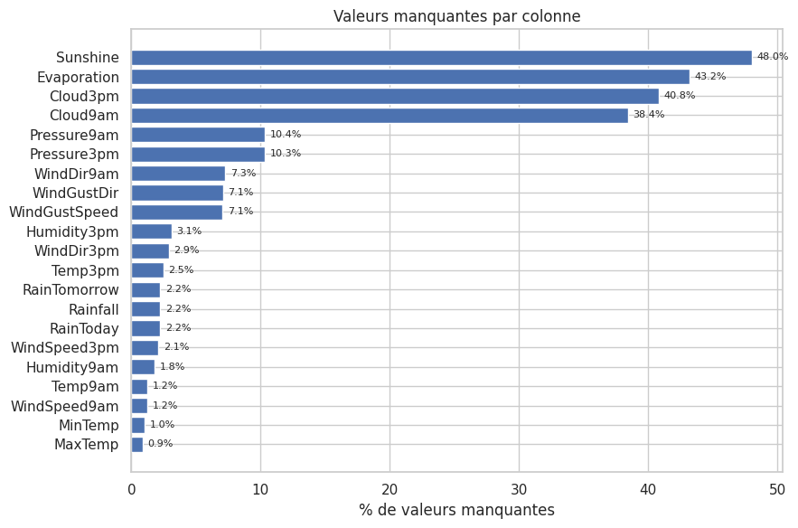
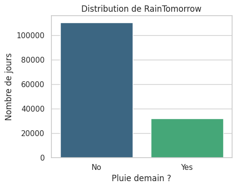
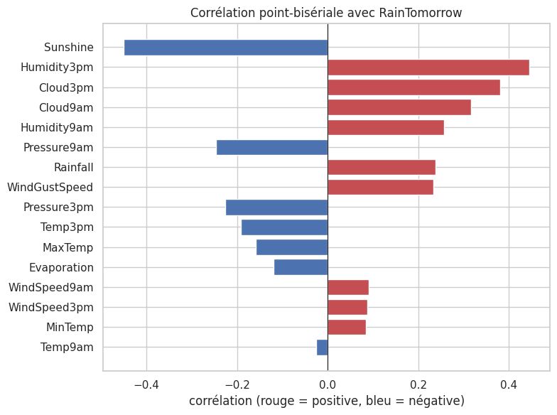
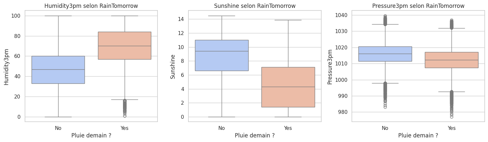
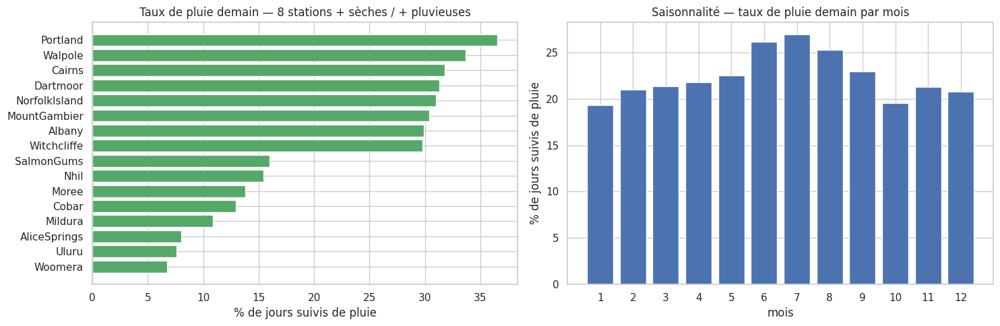

# Prévision de pluie en Australie — 1/3 · Exploration

Dataset Kaggle *Rain in Australia* : dix ans de relevés quotidiens sur 49 stations. On cherche
à prédire `RainTomorrow`, c'est-à-dire s'il tombera au moins 1 mm le lendemain.

Cette partie sert à comprendre les données avant de modéliser : ce qui manque, à quel point la
cible est déséquilibrée, quelles variables portent de l'information, et quel score un modèle
doit dépasser pour être utile.

Suite : `02_preprocessing.ipynb` puis `03_modelisation.ipynb`.

## 0. Setup & chargement des données


```python
import warnings
from pathlib import Path

import numpy as np
import pandas as pd
import matplotlib.pyplot as plt
import seaborn as sns

warnings.filterwarnings("ignore", category=FutureWarning)
sns.set_theme(style="whitegrid")
pd.set_option("display.max_columns", 30)
RANDOM_STATE = 42
```


```python
# Résolution robuste du chemin des données : fonctionne que le notebook soit
# lancé depuis la racine du projet ou depuis le dossier notebooks/.
CANDIDATES = [
    Path("Data/weatherAUS.csv"),
    Path("../Data/weatherAUS.csv"),
    Path.home() / "Desktop/MlOps_Meteo-Liora/Data/weatherAUS.csv",
]
DATA_PATH = next((p for p in CANDIDATES if p.exists()), None)
assert DATA_PATH is not None, "weatherAUS.csv introuvable (vérifier le dossier Data/)"

df = pd.read_csv(DATA_PATH, na_values=["NA"])
print(f"Chargé depuis : {DATA_PATH}")
print(f"Dimensions    : {df.shape[0]:,} lignes × {df.shape[1]} colonnes")
df.head()
```

    Chargé depuis : /home/tinkerbell/Desktop/MlOps_Meteo-Liora/Data/weatherAUS.csv
    Dimensions    : 145,460 lignes × 23 colonnes


<div>
<style scoped>
    .dataframe tbody tr th:only-of-type {
        vertical-align: middle;
    }

    .dataframe tbody tr th {
        vertical-align: top;
    }

    .dataframe thead th {
        text-align: right;
    }
</style>
<table border="1" class="dataframe">
  <thead>
    <tr style="text-align: right;">
      <th></th>
      <th>Date</th>
      <th>Location</th>
      <th>MinTemp</th>
      <th>MaxTemp</th>
      <th>Rainfall</th>
      <th>Evaporation</th>
      <th>Sunshine</th>
      <th>WindGustDir</th>
      <th>WindGustSpeed</th>
      <th>WindDir9am</th>
      <th>WindDir3pm</th>
      <th>WindSpeed9am</th>
      <th>WindSpeed3pm</th>
      <th>Humidity9am</th>
      <th>Humidity3pm</th>
      <th>Pressure9am</th>
      <th>Pressure3pm</th>
      <th>Cloud9am</th>
      <th>Cloud3pm</th>
      <th>Temp9am</th>
      <th>Temp3pm</th>
      <th>RainToday</th>
      <th>RainTomorrow</th>
    </tr>
  </thead>
  <tbody>
    <tr>
      <th>0</th>
      <td>2008-12-01</td>
      <td>Albury</td>
      <td>13.4</td>
      <td>22.9</td>
      <td>0.6</td>
      <td>NaN</td>
      <td>NaN</td>
      <td>W</td>
      <td>44.0</td>
      <td>W</td>
      <td>WNW</td>
      <td>20.0</td>
      <td>24.0</td>
      <td>71.0</td>
      <td>22.0</td>
      <td>1007.7</td>
      <td>1007.1</td>
      <td>8.0</td>
      <td>NaN</td>
      <td>16.9</td>
      <td>21.8</td>
      <td>No</td>
      <td>No</td>
    </tr>
    <tr>
      <th>1</th>
      <td>2008-12-02</td>
      <td>Albury</td>
      <td>7.4</td>
      <td>25.1</td>
      <td>0.0</td>
      <td>NaN</td>
      <td>NaN</td>
      <td>WNW</td>
      <td>44.0</td>
      <td>NNW</td>
      <td>WSW</td>
      <td>4.0</td>
      <td>22.0</td>
      <td>44.0</td>
      <td>25.0</td>
      <td>1010.6</td>
      <td>1007.8</td>
      <td>NaN</td>
      <td>NaN</td>
      <td>17.2</td>
      <td>24.3</td>
      <td>No</td>
      <td>No</td>
    </tr>
    <tr>
      <th>2</th>
      <td>2008-12-03</td>
      <td>Albury</td>
      <td>12.9</td>
      <td>25.7</td>
      <td>0.0</td>
      <td>NaN</td>
      <td>NaN</td>
      <td>WSW</td>
      <td>46.0</td>
      <td>W</td>
      <td>WSW</td>
      <td>19.0</td>
      <td>26.0</td>
      <td>38.0</td>
      <td>30.0</td>
      <td>1007.6</td>
      <td>1008.7</td>
      <td>NaN</td>
      <td>2.0</td>
      <td>21.0</td>
      <td>23.2</td>
      <td>No</td>
      <td>No</td>
    </tr>
    <tr>
      <th>3</th>
      <td>2008-12-04</td>
      <td>Albury</td>
      <td>9.2</td>
      <td>28.0</td>
      <td>0.0</td>
      <td>NaN</td>
      <td>NaN</td>
      <td>NE</td>
      <td>24.0</td>
      <td>SE</td>
      <td>E</td>
      <td>11.0</td>
      <td>9.0</td>
      <td>45.0</td>
      <td>16.0</td>
      <td>1017.6</td>
      <td>1012.8</td>
      <td>NaN</td>
      <td>NaN</td>
      <td>18.1</td>
      <td>26.5</td>
      <td>No</td>
      <td>No</td>
    </tr>
    <tr>
      <th>4</th>
      <td>2008-12-05</td>
      <td>Albury</td>
      <td>17.5</td>
      <td>32.3</td>
      <td>1.0</td>
      <td>NaN</td>
      <td>NaN</td>
      <td>W</td>
      <td>41.0</td>
      <td>ENE</td>
      <td>NW</td>
      <td>7.0</td>
      <td>20.0</td>
      <td>82.0</td>
      <td>33.0</td>
      <td>1010.8</td>
      <td>1006.0</td>
      <td>7.0</td>
      <td>8.0</td>
      <td>17.8</td>
      <td>29.7</td>
      <td>No</td>
      <td>No</td>
    </tr>
  </tbody>
</table>
</div>


## 1. Structure et qualité

Types, doublons, puis valeurs manquantes.


```python
# Types, mémoire et doublons
df.info()
print("\nDoublons exacts :", df.duplicated().sum())
```

    <class 'pandas.core.frame.DataFrame'>
    RangeIndex: 145460 entries, 0 to 145459
    Data columns (total 23 columns):
     #   Column         Non-Null Count   Dtype  
    ---  ------         --------------   -----  
     0   Date           145460 non-null  object 
     1   Location       145460 non-null  object 
     2   MinTemp        143975 non-null  float64
     3   MaxTemp        144199 non-null  float64
     4   Rainfall       142199 non-null  float64
     5   Evaporation    82670 non-null   float64
     6   Sunshine       75625 non-null   float64
     7   WindGustDir    135134 non-null  object 
     8   WindGustSpeed  135197 non-null  float64
     9   WindDir9am     134894 non-null  object 
     10  WindDir3pm     141232 non-null  object 
     11  WindSpeed9am   143693 non-null  float64
     12  WindSpeed3pm   142398 non-null  float64
     13  Humidity9am    142806 non-null  float64
     14  Humidity3pm    140953 non-null  float64
     15  Pressure9am    130395 non-null  float64
     16  Pressure3pm    130432 non-null  float64
     17  Cloud9am       89572 non-null   float64
     18  Cloud3pm       86102 non-null   float64
     19  Temp9am        143693 non-null  float64
     20  Temp3pm        141851 non-null  float64
     21  RainToday      142199 non-null  object 
     22  RainTomorrow   142193 non-null  object 
    dtypes: float64(16), object(7)
    memory usage: 25.5+ MB
    
    Doublons exacts : 0


### 1.1 Valeurs manquantes


```python
missing_pct = (df.isna().mean() * 100).sort_values(ascending=False)
missing_pct = missing_pct[missing_pct > 0]

fig, ax = plt.subplots(figsize=(9, 6))
ax.barh(missing_pct.index[::-1], missing_pct.values[::-1], color="#4C72B0")
ax.set_xlabel("% de valeurs manquantes")
ax.set_title("Valeurs manquantes par colonne")
for i, v in enumerate(missing_pct.values[::-1]):
    ax.text(v + 0.4, i, f"{v:.1f}%", va="center", fontsize=8)
plt.tight_layout()
plt.show()
missing_pct.round(2)
```


    

    


    Sunshine         48.01
    Evaporation      43.17
    Cloud3pm         40.81
    Cloud9am         38.42
    Pressure9am      10.36
    Pressure3pm      10.33
    WindDir9am        7.26
    WindGustDir       7.10
    WindGustSpeed     7.06
    Humidity3pm       3.10
    WindDir3pm        2.91
    Temp3pm           2.48
    RainTomorrow      2.25
    Rainfall          2.24
    RainToday         2.24
    WindSpeed3pm      2.11
    Humidity9am       1.82
    Temp9am           1.21
    WindSpeed9am      1.21
    MinTemp           1.02
    MaxTemp           0.87
    dtype: float64


Quatre colonnes sont très lacunaires : `Sunshine` (48 %), `Evaporation` (43 %), `Cloud3pm`
(41 %) et `Cloud9am` (38 %). Les autres restent sous 10 %.

La tentation serait de les supprimer. On va s'en garder : la section 1.4 montre que `Sunshine`
et `Cloud3pm` sont justement les variables les mieux corrélées à la cible. Elles seront
conservées et imputées, en gardant en tête que près d'une valeur sur deux sera reconstituée.

`RainTomorrow` manque sur 2,2 % des lignes. Ces lignes ne servent à rien pour un apprentissage
supervisé, elles seront retirées.

### 1.2 Variable cible & déséquilibre


```python
fig, ax = plt.subplots(figsize=(5, 4))
order = ["No", "Yes"]
sns.countplot(x="RainTomorrow", data=df, order=order,
              hue="RainTomorrow", hue_order=order, palette="viridis", legend=False, ax=ax)
ax.set_title("Distribution de RainTomorrow")
ax.set_xlabel("Pluie demain ?")
ax.set_ylabel("Nombre de jours")
plt.tight_layout()
plt.show()

vc = df["RainTomorrow"].value_counts(dropna=False)
base_rate = 100 * vc.get("Yes", 0) / (vc.get("Yes", 0) + vc.get("No", 0))
print(vc)
print(f"\nTaux de base (Yes) = {base_rate:.2f}%  ->  classe fortement déséquilibrée (~78/22).")
```


    

    


    RainTomorrow
    No     110316
    Yes     31877
    NaN      3267
    Name: count, dtype: int64
    
    Taux de base (Yes) = 22.42%  ->  classe fortement déséquilibrée (~78/22).


Il pleut le lendemain dans 22 % des cas. Ce déséquilibre pèse sur tout le reste : un modèle
qui répondrait systématiquement « non » afficherait déjà 78 % d'accuracy sans rien avoir appris.

On suivra donc le rappel et le F1 de la classe « pluie », pas l'accuracy globale.

### 1.3 Deux points de comparaison

Avant de lancer un modèle, autant savoir ce qu'il doit battre. La première baseline répond
toujours « non ». La seconde, dite de persistance, recopie la météo du jour : c'est ce que ferait
quelqu'un sans aucune donnée, et en météo c'est étonnamment difficile à battre.


```python
valid = df.dropna(subset=["RainTomorrow"]).copy()

# Baseline 1 : prédire toujours "No"
acc_always_no = 100 * (valid["RainTomorrow"] == "No").mean()

# Baseline 2 : persistance -> "demain = aujourd'hui" (RainTomorrow == RainToday)
persist = valid.dropna(subset=["RainToday"])
acc_persist = 100 * (persist["RainTomorrow"] == persist["RainToday"]).mean()
p_yes_if_today_yes = 100 * (persist.loc[persist.RainToday == "Yes", "RainTomorrow"] == "Yes").mean()
p_yes_if_today_no = 100 * (persist.loc[persist.RainToday == "No", "RainTomorrow"] == "Yes").mean()

print(f"Baseline 'toujours Non'        : accuracy = {acc_always_no:.2f}%")
print(f"Baseline persistance (=RainToday): accuracy = {acc_persist:.2f}%")
print(f"  P(pluie demain | il a plu aujourd'hui)   = {p_yes_if_today_yes:.1f}%")
print(f"  P(pluie demain | pas de pluie aujourd'hui) = {p_yes_if_today_no:.1f}%")
```

    Baseline 'toujours Non'        : accuracy = 77.58%
    Baseline persistance (=RainToday): accuracy = 76.23%
      P(pluie demain | il a plu aujourd'hui)   = 46.4%
      P(pluie demain | pas de pluie aujourd'hui) = 15.2%


La barre est à 78 % pour « toujours non » et 76 % pour la persistance. Autrement dit, un modèle
à 80 % d'accuracy n'apporterait presque rien.

Le détail est plus intéressant que le score : quand il a plu aujourd'hui, la probabilité de pluie
demain passe à 46 %, contre 15 % sinon. `RainToday` porte donc une vraie information — c'est
aussi une variable à surveiller, puisqu'elle dérive de `Rainfall` et pourrait créer une fuite si
on l'utilisait mal.

### 1.4 Variables explicatives — corrélations avec la cible


```python
num_cols = df.select_dtypes(include=np.number).columns.tolist()
y_bin = df["RainTomorrow"].map({"Yes": 1, "No": 0})

corr = {}
for c in num_cols:
    sub = pd.DataFrame({"x": df[c], "y": y_bin}).dropna()
    corr[c] = sub["x"].corr(sub["y"])
corr = pd.Series(corr).sort_values(key=np.abs, ascending=True)

fig, ax = plt.subplots(figsize=(8, 6))
colors = ["#C44E52" if v > 0 else "#4C72B0" for v in corr.values]
ax.barh(corr.index, corr.values, color=colors)
ax.axvline(0, color="k", lw=0.8)
ax.set_title("Corrélation point-bisériale avec RainTomorrow")
ax.set_xlabel("corrélation (rouge = positive, bleu = négative)")
plt.tight_layout()
plt.show()
corr.sort_values(key=np.abs, ascending=False).round(3)
```


    

    


    Sunshine        -0.451
    Humidity3pm      0.446
    Cloud3pm         0.382
    Cloud9am         0.317
    Humidity9am      0.257
    Pressure9am     -0.246
    Rainfall         0.239
    WindGustSpeed    0.234
    Pressure3pm     -0.226
    Temp3pm         -0.192
    MaxTemp         -0.159
    Evaporation     -0.119
    WindSpeed9am     0.091
    WindSpeed3pm     0.088
    MinTemp          0.084
    Temp9am         -0.026
    dtype: float64


Quatre variables se détachent : l'ensoleillement (−0,45), l'humidité de l'après-midi (+0,45),
la nébulosité de l'après-midi (+0,38) et la pression (−0,23).

Rien de surprenant physiquement : moins de soleil, plus d'humidité et de nuages, une pression qui
baisse, et la pluie devient probable. Les mesures de 15 h sont plus prédictives que celles de 9 h,
ce qui est cohérent avec un horizon de prévision de 24 h.


```python
fig, axes = plt.subplots(1, 3, figsize=(15, 4.5))
for ax, col in zip(axes, ["Humidity3pm", "Sunshine", "Pressure3pm"]):
    sns.boxplot(x="RainTomorrow", y=col, data=df, order=["No", "Yes"],
                hue="RainTomorrow", hue_order=["No", "Yes"],
                palette="coolwarm", legend=False, ax=ax)
    ax.set_title(f"{col} selon RainTomorrow")
    ax.set_xlabel("Pluie demain ?")
plt.tight_layout()
plt.show()
```


    

    


### 1.5 Géographie et saison


```python
rate_loc = (valid.assign(y=lambda d: (d.RainTomorrow == "Yes"))
            .groupby("Location")["y"].mean().mul(100).sort_values())
top = pd.concat([rate_loc.head(8), rate_loc.tail(8)])

df["_month"] = pd.to_datetime(df["Date"], errors="coerce").dt.month
rate_month = (df.dropna(subset=["RainTomorrow", "_month"])
              .assign(y=lambda d: (d.RainTomorrow == "Yes"))
              .groupby("_month")["y"].mean().mul(100))

fig, axes = plt.subplots(1, 2, figsize=(15, 5))
axes[0].barh(top.index, top.values, color="#55A868")
axes[0].set_title("Taux de pluie demain — 8 stations + sèches / + pluvieuses")
axes[0].set_xlabel("% de jours suivis de pluie")
axes[1].bar(rate_month.index, rate_month.values, color="#4C72B0")
axes[1].set_title("Saisonnalité — taux de pluie demain par mois")
axes[1].set_xlabel("mois")
axes[1].set_ylabel("% de jours suivis de pluie")
axes[1].set_xticks(range(1, 13))
plt.tight_layout()
plt.show()
print("Mois le + pluvieux:", int(rate_month.idxmax()), f"({rate_month.max():.1f}%)",
      "| + sec:", int(rate_month.idxmin()), f"({rate_month.min():.1f}%)")
```


    

    


    Mois le + pluvieux: 7 (26.9%) | + sec: 1 (19.3%)


L'écart entre stations est considérable : de 7 % de jours suivis de pluie à Woomera et Uluru,
en plein désert, à 37 % à Portland sur la côte sud. Un modèle global devra donc apprendre des
régimes très différents, ce qui plaide pour garder `Location` comme variable.

La saisonnalité est plus discrète mais nette : pic en hiver austral (juin à août, 26-27 %) et
creux en janvier (19 %). De quoi justifier d'extraire le mois de la date, ce que fera le
notebook suivant.
