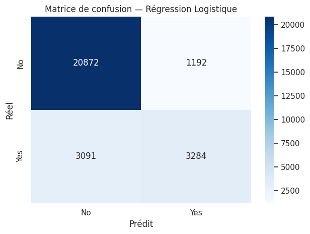
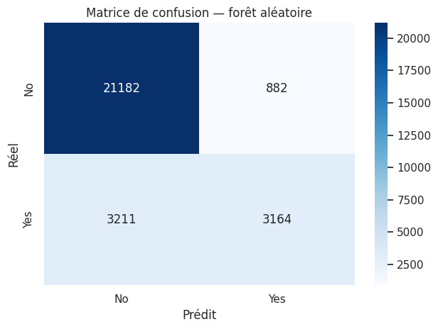
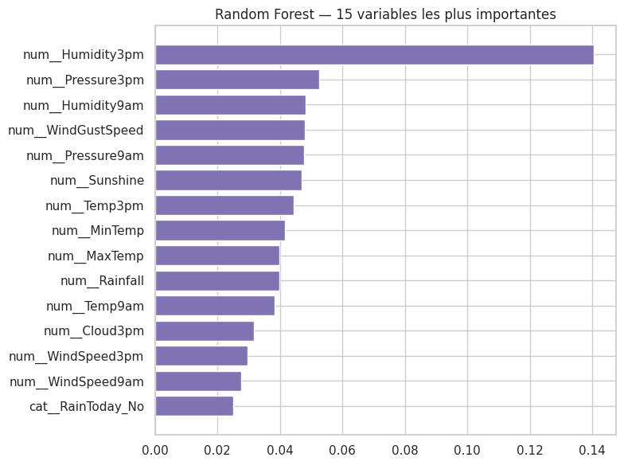
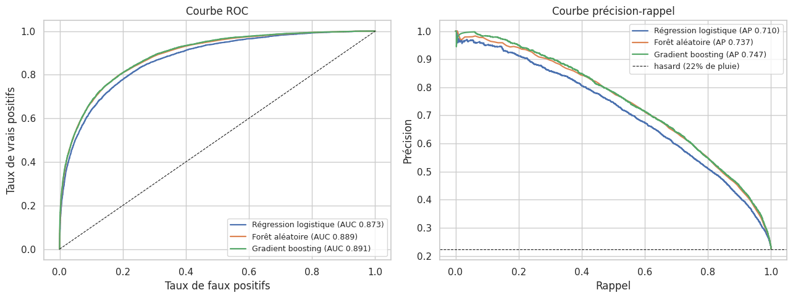
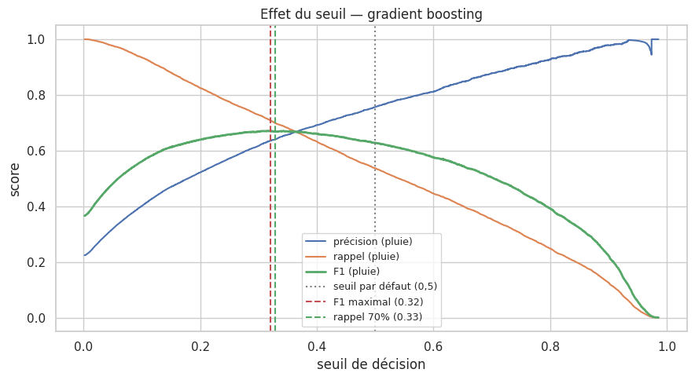

# Prévision de pluie en Australie — 3/3 · Modélisation

Régression logistique, forêt aléatoire et gradient boosting, comparés aux baselines du
notebook 1. On termine sur le choix du seuil de décision, qui est le vrai levier métier ici.

Ce notebook se relance seul : il reconstruit le préprocessing du notebook 2.


```python
import warnings
from pathlib import Path

import numpy as np
import pandas as pd
import matplotlib.pyplot as plt
import seaborn as sns

warnings.filterwarnings("ignore", category=FutureWarning)
sns.set_theme(style="whitegrid")
pd.set_option("display.max_columns", 30)
RANDOM_STATE = 42
```


```python
# Résolution robuste du chemin des données : fonctionne que le notebook soit
# lancé depuis la racine du projet ou depuis le dossier notebooks/.
CANDIDATES = [
    Path("Data/weatherAUS.csv"),
    Path("../Data/weatherAUS.csv"),
    Path.home() / "Desktop/MlOps_Meteo-Liora/Data/weatherAUS.csv",
]
DATA_PATH = next((p for p in CANDIDATES if p.exists()), None)
assert DATA_PATH is not None, "weatherAUS.csv introuvable (vérifier le dossier Data/)"

df = pd.read_csv(DATA_PATH, na_values=["NA"])
print(f"Chargé depuis : {DATA_PATH}")
print(f"Dimensions    : {df.shape[0]:,} lignes × {df.shape[1]} colonnes")
df.head()
```

    Chargé depuis : /home/tinkerbell/Desktop/MlOps_Meteo-Liora/Data/weatherAUS.csv
    Dimensions    : 145,460 lignes × 23 colonnes


<div>
<style scoped>
    .dataframe tbody tr th:only-of-type {
        vertical-align: middle;
    }

    .dataframe tbody tr th {
        vertical-align: top;
    }

    .dataframe thead th {
        text-align: right;
    }
</style>
<table border="1" class="dataframe">
  <thead>
    <tr style="text-align: right;">
      <th></th>
      <th>Date</th>
      <th>Location</th>
      <th>MinTemp</th>
      <th>MaxTemp</th>
      <th>Rainfall</th>
      <th>Evaporation</th>
      <th>Sunshine</th>
      <th>WindGustDir</th>
      <th>WindGustSpeed</th>
      <th>WindDir9am</th>
      <th>WindDir3pm</th>
      <th>WindSpeed9am</th>
      <th>WindSpeed3pm</th>
      <th>Humidity9am</th>
      <th>Humidity3pm</th>
      <th>Pressure9am</th>
      <th>Pressure3pm</th>
      <th>Cloud9am</th>
      <th>Cloud3pm</th>
      <th>Temp9am</th>
      <th>Temp3pm</th>
      <th>RainToday</th>
      <th>RainTomorrow</th>
    </tr>
  </thead>
  <tbody>
    <tr>
      <th>0</th>
      <td>2008-12-01</td>
      <td>Albury</td>
      <td>13.4</td>
      <td>22.9</td>
      <td>0.6</td>
      <td>NaN</td>
      <td>NaN</td>
      <td>W</td>
      <td>44.0</td>
      <td>W</td>
      <td>WNW</td>
      <td>20.0</td>
      <td>24.0</td>
      <td>71.0</td>
      <td>22.0</td>
      <td>1007.7</td>
      <td>1007.1</td>
      <td>8.0</td>
      <td>NaN</td>
      <td>16.9</td>
      <td>21.8</td>
      <td>No</td>
      <td>No</td>
    </tr>
    <tr>
      <th>1</th>
      <td>2008-12-02</td>
      <td>Albury</td>
      <td>7.4</td>
      <td>25.1</td>
      <td>0.0</td>
      <td>NaN</td>
      <td>NaN</td>
      <td>WNW</td>
      <td>44.0</td>
      <td>NNW</td>
      <td>WSW</td>
      <td>4.0</td>
      <td>22.0</td>
      <td>44.0</td>
      <td>25.0</td>
      <td>1010.6</td>
      <td>1007.8</td>
      <td>NaN</td>
      <td>NaN</td>
      <td>17.2</td>
      <td>24.3</td>
      <td>No</td>
      <td>No</td>
    </tr>
    <tr>
      <th>2</th>
      <td>2008-12-03</td>
      <td>Albury</td>
      <td>12.9</td>
      <td>25.7</td>
      <td>0.0</td>
      <td>NaN</td>
      <td>NaN</td>
      <td>WSW</td>
      <td>46.0</td>
      <td>W</td>
      <td>WSW</td>
      <td>19.0</td>
      <td>26.0</td>
      <td>38.0</td>
      <td>30.0</td>
      <td>1007.6</td>
      <td>1008.7</td>
      <td>NaN</td>
      <td>2.0</td>
      <td>21.0</td>
      <td>23.2</td>
      <td>No</td>
      <td>No</td>
    </tr>
    <tr>
      <th>3</th>
      <td>2008-12-04</td>
      <td>Albury</td>
      <td>9.2</td>
      <td>28.0</td>
      <td>0.0</td>
      <td>NaN</td>
      <td>NaN</td>
      <td>NE</td>
      <td>24.0</td>
      <td>SE</td>
      <td>E</td>
      <td>11.0</td>
      <td>9.0</td>
      <td>45.0</td>
      <td>16.0</td>
      <td>1017.6</td>
      <td>1012.8</td>
      <td>NaN</td>
      <td>NaN</td>
      <td>18.1</td>
      <td>26.5</td>
      <td>No</td>
      <td>No</td>
    </tr>
    <tr>
      <th>4</th>
      <td>2008-12-05</td>
      <td>Albury</td>
      <td>17.5</td>
      <td>32.3</td>
      <td>1.0</td>
      <td>NaN</td>
      <td>NaN</td>
      <td>W</td>
      <td>41.0</td>
      <td>ENE</td>
      <td>NW</td>
      <td>7.0</td>
      <td>20.0</td>
      <td>82.0</td>
      <td>33.0</td>
      <td>1010.8</td>
      <td>1006.0</td>
      <td>7.0</td>
      <td>8.0</td>
      <td>17.8</td>
      <td>29.7</td>
      <td>No</td>
      <td>No</td>
    </tr>
  </tbody>
</table>
</div>


## 1. Préprocessing

Repris tel quel du notebook 2 (voir ce dernier pour le détail et la question de la fuite).


```python
data = df.drop(columns=["_month"], errors="ignore").copy()
data = data.dropna(subset=["RainTomorrow"]).copy()

# Cible 0/1
y = (data["RainTomorrow"] == "Yes").astype(int)

# Feature temporelle
data["Month"] = pd.to_datetime(data["Date"], errors="coerce").dt.month.astype("Int64")
data = data.drop(columns=["Date", "RainTomorrow"])

# Listes de features
categorical_features = ["Location", "WindGustDir", "WindDir9am", "WindDir3pm", "RainToday", "Month"]
numeric_features = [c for c in data.columns if c not in categorical_features]
X = data

print(f"Échantillons : {len(X):,}  |  numériques : {len(numeric_features)}  |  catégorielles : {len(categorical_features)}")
print("Numériques  :", numeric_features)
print("Catégoriques:", categorical_features)
```

    Échantillons : 142,193  |  numériques : 16  |  catégorielles : 6
    Numériques  : ['MinTemp', 'MaxTemp', 'Rainfall', 'Evaporation', 'Sunshine', 'WindGustSpeed', 'WindSpeed9am', 'WindSpeed3pm', 'Humidity9am', 'Humidity3pm', 'Pressure9am', 'Pressure3pm', 'Cloud9am', 'Cloud3pm', 'Temp9am', 'Temp3pm']
    Catégoriques: ['Location', 'WindGustDir', 'WindDir9am', 'WindDir3pm', 'RainToday', 'Month']


```python
from sklearn.compose import ColumnTransformer
from sklearn.pipeline import Pipeline
from sklearn.impute import SimpleImputer
from sklearn.preprocessing import StandardScaler, OneHotEncoder

numeric_pipe = Pipeline([
    ("imputer", SimpleImputer(strategy="median")),
    ("scaler", StandardScaler()),
])
categorical_pipe = Pipeline([
    ("imputer", SimpleImputer(strategy="most_frequent")),
    ("onehot", OneHotEncoder(handle_unknown="ignore")),
])
preprocessor = ColumnTransformer([
    ("num", numeric_pipe, numeric_features),
    ("cat", categorical_pipe, categorical_features),
])
preprocessor
```


<style>#sk-container-id-1 {
  /* Definition of color scheme common for light and dark mode */
  --sklearn-color-text: black;
  --sklearn-color-line: gray;
  /* Definition of color scheme for unfitted estimators */
  --sklearn-color-unfitted-level-0: #fff5e6;
  --sklearn-color-unfitted-level-1: #f6e4d2;
  --sklearn-color-unfitted-level-2: #ffe0b3;
  --sklearn-color-unfitted-level-3: chocolate;
  /* Definition of color scheme for fitted estimators */
  --sklearn-color-fitted-level-0: #f0f8ff;
  --sklearn-color-fitted-level-1: #d4ebff;
  --sklearn-color-fitted-level-2: #b3dbfd;
  --sklearn-color-fitted-level-3: cornflowerblue;

  /* Specific color for light theme */
  --sklearn-color-text-on-default-background: var(--sg-text-color, var(--theme-code-foreground, var(--jp-content-font-color1, black)));
  --sklearn-color-background: var(--sg-background-color, var(--theme-background, var(--jp-layout-color0, white)));
  --sklearn-color-border-box: var(--sg-text-color, var(--theme-code-foreground, var(--jp-content-font-color1, black)));
  --sklearn-color-icon: #696969;

  @media (prefers-color-scheme: dark) {
    /* Redefinition of color scheme for dark theme */
    --sklearn-color-text-on-default-background: var(--sg-text-color, var(--theme-code-foreground, var(--jp-content-font-color1, white)));
    --sklearn-color-background: var(--sg-background-color, var(--theme-background, var(--jp-layout-color0, #111)));
    --sklearn-color-border-box: var(--sg-text-color, var(--theme-code-foreground, var(--jp-content-font-color1, white)));
    --sklearn-color-icon: #878787;
  }
}

#sk-container-id-1 {
  color: var(--sklearn-color-text);
}

#sk-container-id-1 pre {
  padding: 0;
}

#sk-container-id-1 input.sk-hidden--visually {
  border: 0;
  clip: rect(1px 1px 1px 1px);
  clip: rect(1px, 1px, 1px, 1px);
  height: 1px;
  margin: -1px;
  overflow: hidden;
  padding: 0;
  position: absolute;
  width: 1px;
}

#sk-container-id-1 div.sk-dashed-wrapped {
  border: 1px dashed var(--sklearn-color-line);
  margin: 0 0.4em 0.5em 0.4em;
  box-sizing: border-box;
  padding-bottom: 0.4em;
  background-color: var(--sklearn-color-background);
}

#sk-container-id-1 div.sk-container {
  /* jupyter's `normalize.less` sets `[hidden] { display: none; }`
     but bootstrap.min.css set `[hidden] { display: none !important; }`
     so we also need the `!important` here to be able to override the
     default hidden behavior on the sphinx rendered scikit-learn.org.
     See: https://github.com/scikit-learn/scikit-learn/issues/21755 */
  display: inline-block !important;
  position: relative;
}

#sk-container-id-1 div.sk-text-repr-fallback {
  display: none;
}

div.sk-parallel-item,
div.sk-serial,
div.sk-item {
  /* draw centered vertical line to link estimators */
  background-image: linear-gradient(var(--sklearn-color-text-on-default-background), var(--sklearn-color-text-on-default-background));
  background-size: 2px 100%;
  background-repeat: no-repeat;
  background-position: center center;
}

/* Parallel-specific style estimator block */

#sk-container-id-1 div.sk-parallel-item::after {
  content: "";
  width: 100%;
  border-bottom: 2px solid var(--sklearn-color-text-on-default-background);
  flex-grow: 1;
}

#sk-container-id-1 div.sk-parallel {
  display: flex;
  align-items: stretch;
  justify-content: center;
  background-color: var(--sklearn-color-background);
  position: relative;
}

#sk-container-id-1 div.sk-parallel-item {
  display: flex;
  flex-direction: column;
}

#sk-container-id-1 div.sk-parallel-item:first-child::after {
  align-self: flex-end;
  width: 50%;
}

#sk-container-id-1 div.sk-parallel-item:last-child::after {
  align-self: flex-start;
  width: 50%;
}

#sk-container-id-1 div.sk-parallel-item:only-child::after {
  width: 0;
}

/* Serial-specific style estimator block */

#sk-container-id-1 div.sk-serial {
  display: flex;
  flex-direction: column;
  align-items: center;
  background-color: var(--sklearn-color-background);
  padding-right: 1em;
  padding-left: 1em;
}


/* Toggleable style: style used for estimator/Pipeline/ColumnTransformer box that is
clickable and can be expanded/collapsed.
- Pipeline and ColumnTransformer use this feature and define the default style
- Estimators will overwrite some part of the style using the `sk-estimator` class
*/

/* Pipeline and ColumnTransformer style (default) */

#sk-container-id-1 div.sk-toggleable {
  /* Default theme specific background. It is overwritten whether we have a
  specific estimator or a Pipeline/ColumnTransformer */
  background-color: var(--sklearn-color-background);
}

/* Toggleable label */
#sk-container-id-1 label.sk-toggleable__label {
  cursor: pointer;
  display: block;
  width: 100%;
  margin-bottom: 0;
  padding: 0.5em;
  box-sizing: border-box;
  text-align: center;
}

#sk-container-id-1 label.sk-toggleable__label-arrow:before {
  /* Arrow on the left of the label */
  content: "▸";
  float: left;
  margin-right: 0.25em;
  color: var(--sklearn-color-icon);
}

#sk-container-id-1 label.sk-toggleable__label-arrow:hover:before {
  color: var(--sklearn-color-text);
}

/* Toggleable content - dropdown */

#sk-container-id-1 div.sk-toggleable__content {
  max-height: 0;
  max-width: 0;
  overflow: hidden;
  text-align: left;
  /* unfitted */
  background-color: var(--sklearn-color-unfitted-level-0);
}

#sk-container-id-1 div.sk-toggleable__content.fitted {
  /* fitted */
  background-color: var(--sklearn-color-fitted-level-0);
}

#sk-container-id-1 div.sk-toggleable__content pre {
  margin: 0.2em;
  border-radius: 0.25em;
  color: var(--sklearn-color-text);
  /* unfitted */
  background-color: var(--sklearn-color-unfitted-level-0);
}

#sk-container-id-1 div.sk-toggleable__content.fitted pre {
  /* unfitted */
  background-color: var(--sklearn-color-fitted-level-0);
}

#sk-container-id-1 input.sk-toggleable__control:checked~div.sk-toggleable__content {
  /* Expand drop-down */
  max-height: 200px;
  max-width: 100%;
  overflow: auto;
}

#sk-container-id-1 input.sk-toggleable__control:checked~label.sk-toggleable__label-arrow:before {
  content: "▾";
}

/* Pipeline/ColumnTransformer-specific style */

#sk-container-id-1 div.sk-label input.sk-toggleable__control:checked~label.sk-toggleable__label {
  color: var(--sklearn-color-text);
  background-color: var(--sklearn-color-unfitted-level-2);
}

#sk-container-id-1 div.sk-label.fitted input.sk-toggleable__control:checked~label.sk-toggleable__label {
  background-color: var(--sklearn-color-fitted-level-2);
}

/* Estimator-specific style */

/* Colorize estimator box */
#sk-container-id-1 div.sk-estimator input.sk-toggleable__control:checked~label.sk-toggleable__label {
  /* unfitted */
  background-color: var(--sklearn-color-unfitted-level-2);
}

#sk-container-id-1 div.sk-estimator.fitted input.sk-toggleable__control:checked~label.sk-toggleable__label {
  /* fitted */
  background-color: var(--sklearn-color-fitted-level-2);
}

#sk-container-id-1 div.sk-label label.sk-toggleable__label,
#sk-container-id-1 div.sk-label label {
  /* The background is the default theme color */
  color: var(--sklearn-color-text-on-default-background);
}

/* On hover, darken the color of the background */
#sk-container-id-1 div.sk-label:hover label.sk-toggleable__label {
  color: var(--sklearn-color-text);
  background-color: var(--sklearn-color-unfitted-level-2);
}

/* Label box, darken color on hover, fitted */
#sk-container-id-1 div.sk-label.fitted:hover label.sk-toggleable__label.fitted {
  color: var(--sklearn-color-text);
  background-color: var(--sklearn-color-fitted-level-2);
}

/* Estimator label */

#sk-container-id-1 div.sk-label label {
  font-family: monospace;
  font-weight: bold;
  display: inline-block;
  line-height: 1.2em;
}

#sk-container-id-1 div.sk-label-container {
  text-align: center;
}

/* Estimator-specific */
#sk-container-id-1 div.sk-estimator {
  font-family: monospace;
  border: 1px dotted var(--sklearn-color-border-box);
  border-radius: 0.25em;
  box-sizing: border-box;
  margin-bottom: 0.5em;
  /* unfitted */
  background-color: var(--sklearn-color-unfitted-level-0);
}

#sk-container-id-1 div.sk-estimator.fitted {
  /* fitted */
  background-color: var(--sklearn-color-fitted-level-0);
}

/* on hover */
#sk-container-id-1 div.sk-estimator:hover {
  /* unfitted */
  background-color: var(--sklearn-color-unfitted-level-2);
}

#sk-container-id-1 div.sk-estimator.fitted:hover {
  /* fitted */
  background-color: var(--sklearn-color-fitted-level-2);
}

/* Specification for estimator info (e.g. "i" and "?") */

/* Common style for "i" and "?" */

.sk-estimator-doc-link,
a:link.sk-estimator-doc-link,
a:visited.sk-estimator-doc-link {
  float: right;
  font-size: smaller;
  line-height: 1em;
  font-family: monospace;
  background-color: var(--sklearn-color-background);
  border-radius: 1em;
  height: 1em;
  width: 1em;
  text-decoration: none !important;
  margin-left: 1ex;
  /* unfitted */
  border: var(--sklearn-color-unfitted-level-1) 1pt solid;
  color: var(--sklearn-color-unfitted-level-1);
}

.sk-estimator-doc-link.fitted,
a:link.sk-estimator-doc-link.fitted,
a:visited.sk-estimator-doc-link.fitted {
  /* fitted */
  border: var(--sklearn-color-fitted-level-1) 1pt solid;
  color: var(--sklearn-color-fitted-level-1);
}

/* On hover */
div.sk-estimator:hover .sk-estimator-doc-link:hover,
.sk-estimator-doc-link:hover,
div.sk-label-container:hover .sk-estimator-doc-link:hover,
.sk-estimator-doc-link:hover {
  /* unfitted */
  background-color: var(--sklearn-color-unfitted-level-3);
  color: var(--sklearn-color-background);
  text-decoration: none;
}

div.sk-estimator.fitted:hover .sk-estimator-doc-link.fitted:hover,
.sk-estimator-doc-link.fitted:hover,
div.sk-label-container:hover .sk-estimator-doc-link.fitted:hover,
.sk-estimator-doc-link.fitted:hover {
  /* fitted */
  background-color: var(--sklearn-color-fitted-level-3);
  color: var(--sklearn-color-background);
  text-decoration: none;
}

/* Span, style for the box shown on hovering the info icon */
.sk-estimator-doc-link span {
  display: none;
  z-index: 9999;
  position: relative;
  font-weight: normal;
  right: .2ex;
  padding: .5ex;
  margin: .5ex;
  width: min-content;
  min-width: 20ex;
  max-width: 50ex;
  color: var(--sklearn-color-text);
  box-shadow: 2pt 2pt 4pt #999;
  /* unfitted */
  background: var(--sklearn-color-unfitted-level-0);
  border: .5pt solid var(--sklearn-color-unfitted-level-3);
}

.sk-estimator-doc-link.fitted span {
  /* fitted */
  background: var(--sklearn-color-fitted-level-0);
  border: var(--sklearn-color-fitted-level-3);
}

.sk-estimator-doc-link:hover span {
  display: block;
}

/* "?"-specific style due to the `<a>` HTML tag */

#sk-container-id-1 a.estimator_doc_link {
  float: right;
  font-size: 1rem;
  line-height: 1em;
  font-family: monospace;
  background-color: var(--sklearn-color-background);
  border-radius: 1rem;
  height: 1rem;
  width: 1rem;
  text-decoration: none;
  /* unfitted */
  color: var(--sklearn-color-unfitted-level-1);
  border: var(--sklearn-color-unfitted-level-1) 1pt solid;
}

#sk-container-id-1 a.estimator_doc_link.fitted {
  /* fitted */
  border: var(--sklearn-color-fitted-level-1) 1pt solid;
  color: var(--sklearn-color-fitted-level-1);
}

/* On hover */
#sk-container-id-1 a.estimator_doc_link:hover {
  /* unfitted */
  background-color: var(--sklearn-color-unfitted-level-3);
  color: var(--sklearn-color-background);
  text-decoration: none;
}

#sk-container-id-1 a.estimator_doc_link.fitted:hover {
  /* fitted */
  background-color: var(--sklearn-color-fitted-level-3);
}
</style><div id="sk-container-id-1" class="sk-top-container"><div class="sk-text-repr-fallback"><pre>ColumnTransformer(transformers=[(&#x27;num&#x27;,
                                 Pipeline(steps=[(&#x27;imputer&#x27;,
                                                  SimpleImputer(strategy=&#x27;median&#x27;)),
                                                 (&#x27;scaler&#x27;, StandardScaler())]),
                                 [&#x27;MinTemp&#x27;, &#x27;MaxTemp&#x27;, &#x27;Rainfall&#x27;,
                                  &#x27;Evaporation&#x27;, &#x27;Sunshine&#x27;, &#x27;WindGustSpeed&#x27;,
                                  &#x27;WindSpeed9am&#x27;, &#x27;WindSpeed3pm&#x27;, &#x27;Humidity9am&#x27;,
                                  &#x27;Humidity3pm&#x27;, &#x27;Pressure9am&#x27;, &#x27;Pressure3pm&#x27;,
                                  &#x27;Cloud9am&#x27;, &#x27;Cloud3pm&#x27;, &#x27;Temp9am&#x27;,
                                  &#x27;Temp3pm&#x27;]),
                                (&#x27;cat&#x27;,
                                 Pipeline(steps=[(&#x27;imputer&#x27;,
                                                  SimpleImputer(strategy=&#x27;most_frequent&#x27;)),
                                                 (&#x27;onehot&#x27;,
                                                  OneHotEncoder(handle_unknown=&#x27;ignore&#x27;))]),
                                 [&#x27;Location&#x27;, &#x27;WindGustDir&#x27;, &#x27;WindDir9am&#x27;,
                                  &#x27;WindDir3pm&#x27;, &#x27;RainToday&#x27;, &#x27;Month&#x27;])])</pre><b>In a Jupyter environment, please rerun this cell to show the HTML representation or trust the notebook. <br />On GitHub, the HTML representation is unable to render, please try loading this page with nbviewer.org.</b></div><div class="sk-container" hidden><div class="sk-item sk-dashed-wrapped"><div class="sk-label-container"><div class="sk-label  sk-toggleable"><input class="sk-toggleable__control sk-hidden--visually" id="sk-estimator-id-1" type="checkbox" ><label for="sk-estimator-id-1" class="sk-toggleable__label  sk-toggleable__label-arrow ">&nbsp;&nbsp;ColumnTransformer<a class="sk-estimator-doc-link " rel="noreferrer" target="_blank" href="https://scikit-learn.org/1.5/modules/generated/sklearn.compose.ColumnTransformer.html">?<span>Documentation for ColumnTransformer</span></a><span class="sk-estimator-doc-link ">i<span>Not fitted</span></span></label><div class="sk-toggleable__content "><pre>ColumnTransformer(transformers=[(&#x27;num&#x27;,
                                 Pipeline(steps=[(&#x27;imputer&#x27;,
                                                  SimpleImputer(strategy=&#x27;median&#x27;)),
                                                 (&#x27;scaler&#x27;, StandardScaler())]),
                                 [&#x27;MinTemp&#x27;, &#x27;MaxTemp&#x27;, &#x27;Rainfall&#x27;,
                                  &#x27;Evaporation&#x27;, &#x27;Sunshine&#x27;, &#x27;WindGustSpeed&#x27;,
                                  &#x27;WindSpeed9am&#x27;, &#x27;WindSpeed3pm&#x27;, &#x27;Humidity9am&#x27;,
                                  &#x27;Humidity3pm&#x27;, &#x27;Pressure9am&#x27;, &#x27;Pressure3pm&#x27;,
                                  &#x27;Cloud9am&#x27;, &#x27;Cloud3pm&#x27;, &#x27;Temp9am&#x27;,
                                  &#x27;Temp3pm&#x27;]),
                                (&#x27;cat&#x27;,
                                 Pipeline(steps=[(&#x27;imputer&#x27;,
                                                  SimpleImputer(strategy=&#x27;most_frequent&#x27;)),
                                                 (&#x27;onehot&#x27;,
                                                  OneHotEncoder(handle_unknown=&#x27;ignore&#x27;))]),
                                 [&#x27;Location&#x27;, &#x27;WindGustDir&#x27;, &#x27;WindDir9am&#x27;,
                                  &#x27;WindDir3pm&#x27;, &#x27;RainToday&#x27;, &#x27;Month&#x27;])])</pre></div> </div></div><div class="sk-parallel"><div class="sk-parallel-item"><div class="sk-item"><div class="sk-label-container"><div class="sk-label  sk-toggleable"><input class="sk-toggleable__control sk-hidden--visually" id="sk-estimator-id-2" type="checkbox" ><label for="sk-estimator-id-2" class="sk-toggleable__label  sk-toggleable__label-arrow ">num</label><div class="sk-toggleable__content "><pre>[&#x27;MinTemp&#x27;, &#x27;MaxTemp&#x27;, &#x27;Rainfall&#x27;, &#x27;Evaporation&#x27;, &#x27;Sunshine&#x27;, &#x27;WindGustSpeed&#x27;, &#x27;WindSpeed9am&#x27;, &#x27;WindSpeed3pm&#x27;, &#x27;Humidity9am&#x27;, &#x27;Humidity3pm&#x27;, &#x27;Pressure9am&#x27;, &#x27;Pressure3pm&#x27;, &#x27;Cloud9am&#x27;, &#x27;Cloud3pm&#x27;, &#x27;Temp9am&#x27;, &#x27;Temp3pm&#x27;]</pre></div> </div></div><div class="sk-serial"><div class="sk-item"><div class="sk-serial"><div class="sk-item"><div class="sk-estimator  sk-toggleable"><input class="sk-toggleable__control sk-hidden--visually" id="sk-estimator-id-3" type="checkbox" ><label for="sk-estimator-id-3" class="sk-toggleable__label  sk-toggleable__label-arrow ">&nbsp;SimpleImputer<a class="sk-estimator-doc-link " rel="noreferrer" target="_blank" href="https://scikit-learn.org/1.5/modules/generated/sklearn.impute.SimpleImputer.html">?<span>Documentation for SimpleImputer</span></a></label><div class="sk-toggleable__content "><pre>SimpleImputer(strategy=&#x27;median&#x27;)</pre></div> </div></div><div class="sk-item"><div class="sk-estimator  sk-toggleable"><input class="sk-toggleable__control sk-hidden--visually" id="sk-estimator-id-4" type="checkbox" ><label for="sk-estimator-id-4" class="sk-toggleable__label  sk-toggleable__label-arrow ">&nbsp;StandardScaler<a class="sk-estimator-doc-link " rel="noreferrer" target="_blank" href="https://scikit-learn.org/1.5/modules/generated/sklearn.preprocessing.StandardScaler.html">?<span>Documentation for StandardScaler</span></a></label><div class="sk-toggleable__content "><pre>StandardScaler()</pre></div> </div></div></div></div></div></div></div><div class="sk-parallel-item"><div class="sk-item"><div class="sk-label-container"><div class="sk-label  sk-toggleable"><input class="sk-toggleable__control sk-hidden--visually" id="sk-estimator-id-5" type="checkbox" ><label for="sk-estimator-id-5" class="sk-toggleable__label  sk-toggleable__label-arrow ">cat</label><div class="sk-toggleable__content "><pre>[&#x27;Location&#x27;, &#x27;WindGustDir&#x27;, &#x27;WindDir9am&#x27;, &#x27;WindDir3pm&#x27;, &#x27;RainToday&#x27;, &#x27;Month&#x27;]</pre></div> </div></div><div class="sk-serial"><div class="sk-item"><div class="sk-serial"><div class="sk-item"><div class="sk-estimator  sk-toggleable"><input class="sk-toggleable__control sk-hidden--visually" id="sk-estimator-id-6" type="checkbox" ><label for="sk-estimator-id-6" class="sk-toggleable__label  sk-toggleable__label-arrow ">&nbsp;SimpleImputer<a class="sk-estimator-doc-link " rel="noreferrer" target="_blank" href="https://scikit-learn.org/1.5/modules/generated/sklearn.impute.SimpleImputer.html">?<span>Documentation for SimpleImputer</span></a></label><div class="sk-toggleable__content "><pre>SimpleImputer(strategy=&#x27;most_frequent&#x27;)</pre></div> </div></div><div class="sk-item"><div class="sk-estimator  sk-toggleable"><input class="sk-toggleable__control sk-hidden--visually" id="sk-estimator-id-7" type="checkbox" ><label for="sk-estimator-id-7" class="sk-toggleable__label  sk-toggleable__label-arrow ">&nbsp;OneHotEncoder<a class="sk-estimator-doc-link " rel="noreferrer" target="_blank" href="https://scikit-learn.org/1.5/modules/generated/sklearn.preprocessing.OneHotEncoder.html">?<span>Documentation for OneHotEncoder</span></a></label><div class="sk-toggleable__content "><pre>OneHotEncoder(handle_unknown=&#x27;ignore&#x27;)</pre></div> </div></div></div></div></div></div></div></div></div></div></div>


## 2. Entraînement

Trois familles de modèles, chacune dans un pipeline avec le préprocesseur pour que rien ne soit
ajusté sur le test. Le déséquilibre 78/22 vu au notebook 1 impose de regarder le rappel de la
classe « pluie » plutôt que l'accuracy : un modèle qui répond toujours « non » atteint déjà 78 %.


```python
from sklearn.model_selection import train_test_split
from sklearn.linear_model import LogisticRegression
from sklearn.ensemble import RandomForestClassifier, HistGradientBoostingClassifier
from sklearn.metrics import (accuracy_score, classification_report, confusion_matrix,
                             roc_auc_score, recall_score, f1_score, precision_score,
                             roc_curve, precision_recall_curve, average_precision_score)

X_train, X_test, y_train, y_test = train_test_split(
    X, y, test_size=0.2, random_state=RANDOM_STATE, stratify=y)
print(f"Train : {X_train.shape[0]:,}  |  Test : {X_test.shape[0]:,}")
```

    Train : 113,754  |  Test : 28,439


### 2.1 Régression logistique


```python
pipe_lr = Pipeline([("prep", preprocessor),
                    ("clf", LogisticRegression(max_iter=1000, random_state=RANDOM_STATE))])
pipe_lr.fit(X_train, y_train)
y_pred_lr = pipe_lr.predict(X_test)
proba_lr = pipe_lr.predict_proba(X_test)[:, 1]

print(f"Accuracy : {accuracy_score(y_test, y_pred_lr):.4f}   ROC-AUC : {roc_auc_score(y_test, proba_lr):.4f}")
print(classification_report(y_test, y_pred_lr, target_names=["No", "Yes"]))

cm = confusion_matrix(y_test, y_pred_lr)
sns.heatmap(cm, annot=True, fmt="d", cmap="Blues",
            xticklabels=["No", "Yes"], yticklabels=["No", "Yes"])
plt.title("Matrice de confusion — Régression Logistique")
plt.xlabel("Prédit"); plt.ylabel("Réel"); plt.tight_layout(); plt.show()
```

    Accuracy : 0.8494   ROC-AUC : 0.8730
                  precision    recall  f1-score   support
    
              No       0.87      0.95      0.91     22064
             Yes       0.73      0.52      0.61      6375
    
        accuracy                           0.85     28439
       macro avg       0.80      0.73      0.76     28439
    weighted avg       0.84      0.85      0.84     28439
    


    

    


Accuracy correcte (~0,85) mais le rappel sur la classe « pluie » plafonne autour de 0,5 : le
modèle rate à peu près un jour de pluie sur deux. La ROC-AUC de ~0,87 montre pourtant que les
probabilités classent bien les observations — c'est le seuil à 0,5 qui est mal placé, pas le
modèle qui est mauvais. On y revient en section 4.

### 2.2 Forêt aléatoire


```python
from time import perf_counter

pipe_rf = Pipeline([("prep", preprocessor),
                    ("clf", RandomForestClassifier(n_estimators=100, n_jobs=-1,
                                                   random_state=RANDOM_STATE))])
t0 = perf_counter()
pipe_rf.fit(X_train, y_train)
duree_rf = perf_counter() - t0

y_pred_rf = pipe_rf.predict(X_test)
proba_rf = pipe_rf.predict_proba(X_test)[:, 1]

print(f"Entraînement : {duree_rf:.1f} s")
print(f"Accuracy : {accuracy_score(y_test, y_pred_rf):.4f}   ROC-AUC : {roc_auc_score(y_test, proba_rf):.4f}")
print(classification_report(y_test, y_pred_rf, target_names=["No", "Yes"]))

cm = confusion_matrix(y_test, y_pred_rf)
sns.heatmap(cm, annot=True, fmt="d", cmap="Blues",
            xticklabels=["No", "Yes"], yticklabels=["No", "Yes"])
plt.title("Matrice de confusion — forêt aléatoire")
plt.xlabel("Prédit"); plt.ylabel("Réel"); plt.tight_layout(); plt.show()
```

    Entraînement : 21.7 s
    Accuracy : 0.8561   ROC-AUC : 0.8887
                  precision    recall  f1-score   support
    
              No       0.87      0.96      0.91     22064
             Yes       0.78      0.50      0.61      6375
    
        accuracy                           0.86     28439
       macro avg       0.83      0.73      0.76     28439
    weighted avg       0.85      0.86      0.84     28439
    


    

    


```python
# Importance des variables (top 15)
feat_names = pipe_rf.named_steps["prep"].get_feature_names_out()
importances = pd.Series(pipe_rf.named_steps["clf"].feature_importances_, index=feat_names)
top15 = importances.sort_values(ascending=False).head(15)

fig, ax = plt.subplots(figsize=(8, 6))
ax.barh(top15.index[::-1], top15.values[::-1], color="#8172B3")
ax.set_title("Random Forest — 15 variables les plus importantes")
plt.tight_layout(); plt.show()
top15.round(4)
```


    

    


    num__Humidity3pm      0.1406
    num__Pressure3pm      0.0525
    num__Humidity9am      0.0482
    num__WindGustSpeed    0.0479
    num__Pressure9am      0.0478
    num__Sunshine         0.0469
    num__Temp3pm          0.0443
    num__MinTemp          0.0416
    num__MaxTemp          0.0400
    num__Rainfall         0.0399
    num__Temp9am          0.0383
    num__Cloud3pm         0.0317
    num__WindSpeed3pm     0.0297
    num__WindSpeed9am     0.0275
    cat__RainToday_No     0.0250
    dtype: float64


Accuracy et ROC-AUC légèrement meilleures que la régression logistique, mais le rappel descend
encore un peu (0,50 contre 0,52).

`Humidity3pm` domine nettement les importances, avec un poids trois fois supérieur à la variable
suivante. Viennent ensuite la pression, l'humidité du matin et la force des rafales. `Sunshine`,
que l'EDA donnait comme le prédicteur le plus corrélé à la cible, arrive plus bas : la forêt
répartit son importance sur des variables corrélées entre elles, et `Sunshine` est aussi la
colonne la plus lacunaire du dataset (48 % de valeurs manquantes, donc souvent imputée).

### 2.3 Gradient boosting

`HistGradientBoostingClassifier` est l'implémentation par histogrammes de scikit-learn, pensée
pour les gros volumes tabulaires. Une contrainte pratique : il n'accepte pas les matrices
creuses, alors que `OneHotEncoder` en produit par défaut. Il faut donc un préprocesseur qui
renvoie du dense.


```python
from sklearn.compose import ColumnTransformer
from sklearn.impute import SimpleImputer
from sklearn.preprocessing import StandardScaler, OneHotEncoder

# Meme preprocessing, mais sortie dense : HistGB refuse le sparse
# (TypeError: Sparse data was passed for X, but dense data is required).
prep_dense = ColumnTransformer([
    ("num", Pipeline([("imputer", SimpleImputer(strategy="median")),
                      ("scaler", StandardScaler())]), numeric_features),
    ("cat", Pipeline([("imputer", SimpleImputer(strategy="most_frequent")),
                      ("onehot", OneHotEncoder(handle_unknown="ignore",
                                               sparse_output=False))]), categorical_features),
])

pipe_hgb = Pipeline([("prep", prep_dense),
                     ("clf", HistGradientBoostingClassifier(random_state=RANDOM_STATE))])
t0 = perf_counter()
pipe_hgb.fit(X_train, y_train)
duree_hgb = perf_counter() - t0

y_pred_hgb = pipe_hgb.predict(X_test)
proba_hgb = pipe_hgb.predict_proba(X_test)[:, 1]

print(f"Entraînement : {duree_hgb:.1f} s  (forêt aléatoire : {duree_rf:.1f} s)")
print(f"Accuracy : {accuracy_score(y_test, y_pred_hgb):.4f}   ROC-AUC : {roc_auc_score(y_test, proba_hgb):.4f}")
print(classification_report(y_test, y_pred_hgb, target_names=["No", "Yes"]))
```

    Entraînement : 2.7 s  (forêt aléatoire : 21.7 s)
    Accuracy : 0.8575   ROC-AUC : 0.8907
                  precision    recall  f1-score   support
    
              No       0.88      0.95      0.91     22064
             Yes       0.76      0.54      0.63      6375
    
        accuracy                           0.86     28439
       macro avg       0.82      0.74      0.77     28439
    weighted avg       0.85      0.86      0.85     28439
    


Meilleur que la forêt sur l'accuracy, la ROC-AUC, le rappel et le F1. Un point va dans l'autre
sens : la précision baisse (0,76 contre 0,78). Le modèle annonce un peu plus de pluie, donc il
en rate moins et se trompe un peu plus souvent quand il annonce — sur une cible déséquilibrée
c'est plutôt l'échange qu'on cherche.

C'est le modèle qu'on retiendrait pour la production. La version actuellement déployée utilise
une forêt ; le passage à HistGB demande de mettre `OneHotEncoder(sparse_output=False)` dans
`App/src/data.py`, sinon l'entraînement échoue sur le type de matrice.

### 2.4 Comparatif

On ajoute une régression logistique `class_weight="balanced"` : elle rééquilibre artificiellement
les deux classes pendant l'apprentissage et remonte fortement le rappel, au prix de l'accuracy.
C'est une autre façon d'attaquer le même problème que le réglage du seuil.


```python
pipe_lr_bal = Pipeline([("prep", preprocessor),
                        ("clf", LogisticRegression(max_iter=1000, random_state=RANDOM_STATE,
                                                   class_weight="balanced"))])
pipe_lr_bal.fit(X_train, y_train)
y_pred_bal = pipe_lr_bal.predict(X_test)
proba_bal = pipe_lr_bal.predict_proba(X_test)[:, 1]

def ligne(nom, y_pred, proba=None):
    return {
        "Modèle": nom,
        "Accuracy": round(accuracy_score(y_test, y_pred), 4),
        "Précision (pluie)": round(precision_score(y_test, y_pred, zero_division=0), 4),
        "Rappel (pluie)": round(recall_score(y_test, y_pred), 4),
        "F1 (pluie)": round(f1_score(y_test, y_pred), 4),
        "ROC-AUC": round(roc_auc_score(y_test, proba), 4) if proba is not None else np.nan,
    }

compare = pd.DataFrame([
    ligne("Baseline toujours 'Non'", np.zeros_like(y_test)),
    ligne("Régression logistique", y_pred_lr, proba_lr),
    ligne("Régression logistique (balanced)", y_pred_bal, proba_bal),
    ligne("Forêt aléatoire", y_pred_rf, proba_rf),
    ligne("Gradient boosting", y_pred_hgb, proba_hgb),
]).set_index("Modèle")
compare
```


<div>
<style scoped>
    .dataframe tbody tr th:only-of-type {
        vertical-align: middle;
    }

    .dataframe tbody tr th {
        vertical-align: top;
    }

    .dataframe thead th {
        text-align: right;
    }
</style>
<table border="1" class="dataframe">
  <thead>
    <tr style="text-align: right;">
      <th></th>
      <th>Accuracy</th>
      <th>Précision (pluie)</th>
      <th>Rappel (pluie)</th>
      <th>F1 (pluie)</th>
      <th>ROC-AUC</th>
    </tr>
    <tr>
      <th>Modèle</th>
      <th></th>
      <th></th>
      <th></th>
      <th></th>
      <th></th>
    </tr>
  </thead>
  <tbody>
    <tr>
      <th>Baseline toujours 'Non'</th>
      <td>0.7758</td>
      <td>0.0000</td>
      <td>0.0000</td>
      <td>0.0000</td>
      <td>NaN</td>
    </tr>
    <tr>
      <th>Régression logistique</th>
      <td>0.8494</td>
      <td>0.7337</td>
      <td>0.5151</td>
      <td>0.6053</td>
      <td>0.8730</td>
    </tr>
    <tr>
      <th>Régression logistique (balanced)</th>
      <td>0.7955</td>
      <td>0.5299</td>
      <td>0.7795</td>
      <td>0.6309</td>
      <td>0.8737</td>
    </tr>
    <tr>
      <th>Forêt aléatoire</th>
      <td>0.8561</td>
      <td>0.7820</td>
      <td>0.4963</td>
      <td>0.6072</td>
      <td>0.8887</td>
    </tr>
    <tr>
      <th>Gradient boosting</th>
      <td>0.8575</td>
      <td>0.7570</td>
      <td>0.5366</td>
      <td>0.6281</td>
      <td>0.8907</td>
    </tr>
  </tbody>
</table>
</div>


Le tableau résume l'arbitrage. Les trois modèles « bruts » se tiennent entre 0,85 et 0,86
d'accuracy pour un rappel de 0,50 à 0,54 — la baseline « toujours Non », elle, affiche 0,776
d'accuracy avec un rappel nul, ce qui rappelle à quel point l'accuracy seule est trompeuse ici.

La variante `balanced` prend le problème à l'envers : rappel à 0,78, mais l'accuracy tombe à
0,80 et la précision à 0,53, autrement dit près d'une alerte sur deux est fausse. Aucune de ces
deux positions n'est bonne dans l'absolu ; tout dépend du coût respectif d'une pluie manquée et
d'une fausse alerte.

## 3. Courbes ROC et précision-rappel

La courbe ROC est flatteuse sur les classes déséquilibrées parce que les vrais négatifs, très
nombreux, dominent le calcul. La courbe précision-rappel décrit mieux ce qui nous intéresse ici :
la capacité à retrouver les 22 % de jours pluvieux.


```python
fig, (ax1, ax2) = plt.subplots(1, 2, figsize=(13, 5))

modeles = [("Régression logistique", proba_lr),
           ("Forêt aléatoire", proba_rf),
           ("Gradient boosting", proba_hgb)]

for nom, proba in modeles:
    fpr, tpr, _ = roc_curve(y_test, proba)
    ax1.plot(fpr, tpr, lw=1.6, label=f"{nom} (AUC {roc_auc_score(y_test, proba):.3f})")
ax1.plot([0, 1], [0, 1], "k--", lw=0.8)
ax1.set_xlabel("Taux de faux positifs"); ax1.set_ylabel("Taux de vrais positifs")
ax1.set_title("Courbe ROC"); ax1.legend(loc="lower right", fontsize=9)

for nom, proba in modeles:
    prec, rec, _ = precision_recall_curve(y_test, proba)
    ax2.plot(rec, prec, lw=1.6, label=f"{nom} (AP {average_precision_score(y_test, proba):.3f})")
ax2.axhline(y_test.mean(), color="k", ls="--", lw=0.8,
            label=f"hasard ({100*y_test.mean():.0f}% de pluie)")
ax2.set_xlabel("Rappel"); ax2.set_ylabel("Précision")
ax2.set_title("Courbe précision-rappel"); ax2.legend(fontsize=9)

plt.tight_layout(); plt.show()
```


    

    


Les trois courbes ROC sont proches et toutes très au-dessus de la diagonale. La lecture
précision-rappel est plus sévère et plus utile : la précision décroche à partir d'un rappel
d'environ 0,7, ce qui donne un ordre de grandeur du compromis atteignable.

## 4. Le seuil de décision

`predict()` applique un seuil de 0,5 sur la probabilité. Ce choix n'a rien d'évident : il
maximise à peu près l'accuracy, or l'accuracy n'est pas le bon critère sur une cible à 22 %.
Déplacer le seuil ne change pas le modèle, seulement le point de fonctionnement.

C'est ce que pilote la variable `DECISION_THRESHOLD` de l'API en production.


```python
prec, rec, thr = precision_recall_curve(y_test, proba_hgb)
prec, rec = prec[:-1], rec[:-1]          # alignes sur thr
f1 = 2 * prec * rec / (prec + rec + 1e-12)

i_f1 = int(np.nanargmax(f1))
seuil_f1 = thr[i_f1]

cible = 0.70
possibles = np.where(rec >= cible)[0]
seuil_r70 = thr[possibles.max()] if len(possibles) else np.nan

fig, ax = plt.subplots(figsize=(9, 5))
ax.plot(thr, prec, label="précision (pluie)")
ax.plot(thr, rec, label="rappel (pluie)")
ax.plot(thr, f1, label="F1 (pluie)", lw=2)
ax.axvline(0.5, color="grey", ls=":", label="seuil par défaut (0,5)")
ax.axvline(seuil_f1, color="C3", ls="--", label=f"F1 maximal ({seuil_f1:.2f})")
ax.axvline(seuil_r70, color="C2", ls="--", label=f"rappel {cible:.0%} ({seuil_r70:.2f})")
ax.set_xlabel("seuil de décision"); ax.set_ylabel("score")
ax.set_title("Effet du seuil — gradient boosting")
ax.legend(fontsize=9); plt.tight_layout(); plt.show()

recap = pd.DataFrame([
    {"Seuil": 0.5, "Précision": precision_score(y_test, proba_hgb >= 0.5),
     "Rappel": recall_score(y_test, proba_hgb >= 0.5), "F1": f1_score(y_test, proba_hgb >= 0.5)},
    {"Seuil": round(float(seuil_f1), 3), "Précision": precision_score(y_test, proba_hgb >= seuil_f1),
     "Rappel": recall_score(y_test, proba_hgb >= seuil_f1), "F1": f1_score(y_test, proba_hgb >= seuil_f1)},
    {"Seuil": round(float(seuil_r70), 3), "Précision": precision_score(y_test, proba_hgb >= seuil_r70),
     "Rappel": recall_score(y_test, proba_hgb >= seuil_r70), "F1": f1_score(y_test, proba_hgb >= seuil_r70)},
]).round(4).set_index("Seuil")
recap
```


    

    


<div>
<style scoped>
    .dataframe tbody tr th:only-of-type {
        vertical-align: middle;
    }

    .dataframe tbody tr th {
        vertical-align: top;
    }

    .dataframe thead th {
        text-align: right;
    }
</style>
<table border="1" class="dataframe">
  <thead>
    <tr style="text-align: right;">
      <th></th>
      <th>Précision</th>
      <th>Rappel</th>
      <th>F1</th>
    </tr>
    <tr>
      <th>Seuil</th>
      <th></th>
      <th></th>
      <th></th>
    </tr>
  </thead>
  <tbody>
    <tr>
      <th>0.500</th>
      <td>0.7570</td>
      <td>0.5366</td>
      <td>0.6281</td>
    </tr>
    <tr>
      <th>0.320</th>
      <td>0.6359</td>
      <td>0.7101</td>
      <td>0.6710</td>
    </tr>
    <tr>
      <th>0.328</th>
      <td>0.6402</td>
      <td>0.7001</td>
      <td>0.6688</td>
    </tr>
  </tbody>
</table>
</div>


Descendre le seuil de 0,50 à 0,32 fait passer le rappel de 0,54 à 0,71, en cédant douze points
de précision (0,76 → 0,64). Le F1 y gagne quatre points. En clair : on rattrape un tiers des
jours de pluie qu'on manquait, au prix de fausses alertes plus fréquentes.

Les deux seuils calculés ici, celui qui maximise le F1 (0,320) et celui qui vise un rappel de
0,70 (0,328), tombent presque au même endroit — ce n'est pas toujours le cas, mais ça donne une
zone de réglage cohérente.

Trancher pour de bon demanderait une matrice de coût, qu'on n'a pas. Pour une prévision météo
grand public, manquer une pluie est plus gênant qu'annoncer une pluie qui ne tombe pas, ce qui
plaide pour un seuil bas. C'est cette valeur qu'on proposerait comme `DECISION_THRESHOLD` à
l'API, sachant qu'elle est estimée sur le test et mériterait d'être confirmée en validation
croisée.

## 5. Conclusions

Sur les données. Dataset propre (aucun doublon), 142 193 observations exploitables réparties sur
49 stations et dix ans. La cible est déséquilibrée à 22 %, ce qui disqualifie l'accuracy comme
critère unique. Les prédicteurs les plus utiles sont cohérents avec la physique : humidité de
l'après-midi, pression, ensoleillement, nébulosité.

Sur les modèles. Les trois familles testées se tiennent (0,85 à 0,86 d'accuracy, ROC-AUC de 0,873
à 0,891), le gradient boosting arrivant en tête sur presque tous les critères et pour un temps
d'entraînement plus court que la forêt. Le rappel brut reste autour de 0,54, ce qui est
insuffisant pour un usage réel.

Le vrai levier n'est pas le choix du modèle mais le seuil : à modèle constant, passer de 0,50 à
0,32 gagne dix-sept points de rappel, quand l'écart entre le meilleur et le pire des trois
modèles n'en vaut que quatre. Comparer des modèles sans regarder leur point de fonctionnement
revient à comparer des réglages arbitraires.

Limites. Les seuils sont estimés sur le jeu de test, ce qui est optimiste — une validation
croisée serait plus rigoureuse. Le découpage train/test est aléatoire alors que les données sont
temporelles : un découpage chronologique serait plus fidèle à l'usage réel, où l'on prédit
l'avenir à partir du passé.

Pistes non explorées faute de temps : saisonnalité en variable cyclique plutôt qu'en one-hot,
variables décalées (météo de la veille), et un modèle par région plutôt qu'un modèle global —
les 49 stations ont des régimes très différents, de 7 % de jours pluvieux à Uluru à 37 % à
Portland.

Côté MLOps, la suite est dans `App/` : ce pipeline est repris dans `src/train.py`, suivi dans
MLflow, et servi par une API FastAPI qui expose le seuil en variable d'environnement.
